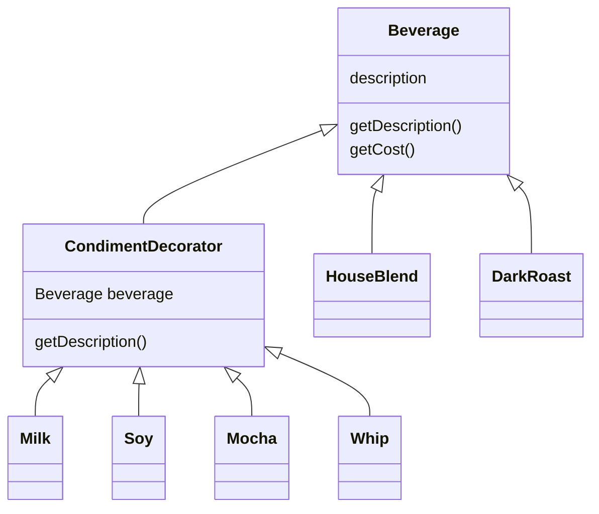

# Chapter 3: Decorating Objects

- How would you design your system if you need to create one object that may have many extension-objects?

## The Naive Approach

- The naive approach is to create a class for each type
- This is like a class explosion, and creates a maintanance nightmare

## A Better Approach

- A better approach is to make a sub class for each extension and a method for each extension
- This is better, but it violates the open closed principle

## The Decorator Approach

- It's to make every class a decorator that can be wrapped by another decorator
- We start with the main object, then we docorate it with the extensions

